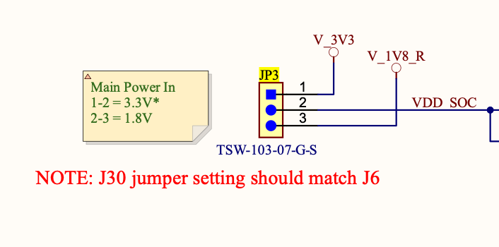
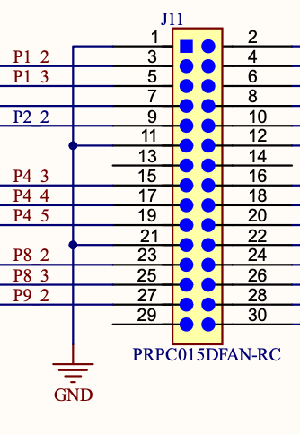
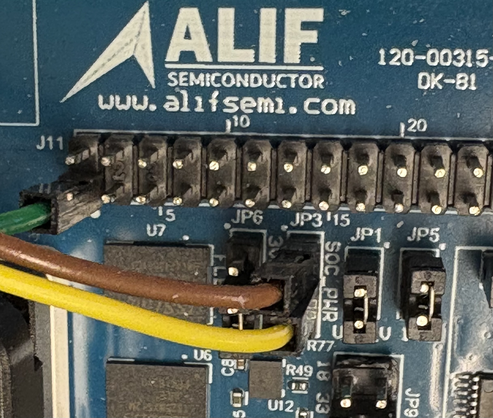

.. _simple-pm-sample:

Simple power management sample
##############################

Overview
********

Demonstrates the Alif low-power (STOP mode) sleep cycle on the RTSS-HE core
without the Bluetooth stack. The application configures the Secure Enclave
off/run profiles, then repeatedly enters deep sleep and wakes from a selectable
source:

* **RTC timer** (default): periodic wakeup every ``CONFIG_SLEEP_TIME_DISCONNECTED`` ms.
* **LPGPIO**: wakeup on a low-power GPIO edge.
* **LPCMP**: wakeup on the low-power analog comparator crossing its reference.

.. note::

   This sample is derived from :zephyr_file:`samples/bluetooth/le_periph_pm`
   with the BLE functionality removed and LPCMP wakeup added.

Requirements
************

* Alif Balletto Development Kit (``alif_b1_dk``) or compatible board.
* Joulescope (optional) for power consumption measurement.

Building and Running
********************

Default build (RTC periodic wakeup):

.. code-block:: console

   west build -b alif_b1_dk/ab1c1f4m51820ph0/rtss_he alif/samples/simple_pm/

Building ITCM
=============

To optimize standby power, build to ITCM without MRAM:

.. code-block:: console

   west build -b alif_b1_dk/ab1c1f4m51820ph0/rtss_he alif/samples/simple_pm/ -- -DEXTRA_DTC_OVERLAY_FILE=itcm_build.overlay

When flashing, ensure Secure Enclave tracing is disabled by setting
``SE_BOOT_INFO`` to 2 in ``add-device-config.json``:

.. code-block:: console

    {
      "id": "SE_BOOT_INFO",
      "value": 2
    }

Wakeup source: LPGPIO
=====================

LPGPIO wakeup supports pins P15_0 and P15_1, selected by setting
``CONFIG_LPGPIO_WAKEUP_SOURCE`` to 0 or 1 respectively:

.. code-block:: console

   west build -Slpgpio-wakeup -b alif_b1_dk/ab1c1f4m51820ph0/rtss_he alif/samples/simple_pm/
   west build -Slpgpio-wakeup -b alif_b1_dk/ab1c1f4m51820ph0/rtss_he alif/samples/simple_pm/ -- -DCONFIG_LPGPIO_WAKEUP_SOURCE=0

Wakeup source: LPCMP
====================

The ``lpcmp-wakeup`` snippet enables the low-power comparator as the wakeup
source and disables the periodic RTC wakeup (``CONFIG_SLEEP_TIME_DISCONNECTED=0``),
so the core sleeps until the comparator input crosses its reference:

.. code-block:: console

   west build -Slpcmp-wakeup -b alif_b1_dk/ab1c1f4m51820ph0/rtss_he alif/samples/simple_pm/

The default overlay compares the positive input against the internal VREF1 with a
rising-edge trigger. One wakeup is produced per low-to-high crossing; holding the
input high produces no further events until it returns low. A 5 second safety
re-arm prevents the loop from wedging if an event is missed across suspend/resume.

.. warning::

   On the B1 DK the LPCMP positive input is limited by hardware to P2_4-P2_7
   (analog channels ANA_S12-ANA_S15). On this board P2_4/P2_5 are wired to the
   I2S audio codec and P2_6/P2_7 to the SD-card level translator, so there is no
   dedicated analog test pin. The default overlay uses P2_4 (``CMP_POS_IN0``);
   drive it across VREF1 through the codec net to trigger a wakeup. Edit
   :zephyr_file:`samples/simple_pm/snippets/lpcmp/lpcmp.overlay` to select a
   different input.

Expected output
***************

Default (RTC) build prints a ``w`` on each periodic wakeup:

.. code-block:: console

   Simple sleep demo
   w
   w

LPCMP build prints the analog config registers at start, then ``lpcmp!``
followed by ``w`` on each rising-edge wakeup:

.. code-block:: console

   Simple sleep demo
   req1: 0x00441E10
   req2: 0xE0CC4634
   lpcmp!
   w

Setting up the measurement device
*********************************

See the following descriptions how to connect the joulescope to measure the power consumption.

Replace JP3 jumper with two jumper wires going to the current measurement ports.

Connect the ground wire to J11 ground pin example pin 1.

Connect the joulescope.

Example Setup connections using 3.3v input voltage.

* Ground: J11 Pin 1

* Current measure: JP3 pin 1

* Current measure: JP3 pin 2

Measuring the power consumption
*******************************

Each sleep cycle the RTSS-HE core enters STOP mode and wakes from the configured
source. Use the joulescope to observe the low sleep current between wakeups and
the short current spike at each wakeup event:

* **Sleep floor** current draw while the core is in STOP mode between events.

* **Wakeup spike** current during the brief active window when the wakeup source
  (RTC, LPGPIO, or LPCMP) fires and the application prints and re-arms.
